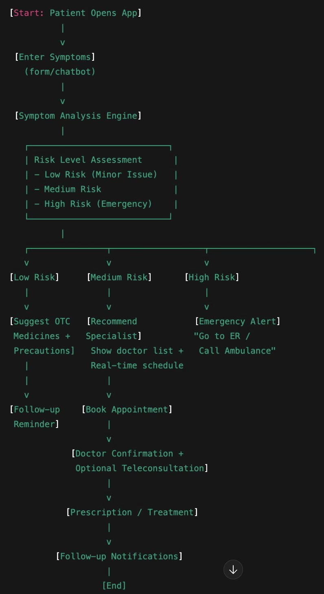

# 🏥 TeleSana

**Bridging Healthcare Through Technology**

_Tele_ (Telemedicine) + _Sana_ (Latin: Health & Life)

[Features](#-features) • [Tech Stack](#-tech-stack) • [Getting Started](#-getting-started) • [Workflow](#-application-workflow) • [Database](#-database-schema) • [Contributing](#-contributing)

---

## 📋 Overview

TeleSana is a comprehensive hospital management application designed to streamline healthcare delivery by providing an intelligent mediator between patients and doctors. The platform leverages AI-powered diagnosis, seamless appointment booking, and real-time video consultations to make healthcare accessible and efficient.

### 🎯 Mission

To provide easy and smooth interaction between doctors and patients through innovative telemedicine solutions.

---

## ✨ Features

### Core Modules

- **🤖 AI Chatbot Diagnosis**: Intelligent symptom analysis engine with risk level assessment

  - Low Risk: Suggests OTC medicines and precautions
  - Medium Risk: Recommends specialists with real-time availability
  - High Risk: Emergency alert with ER directions

- **👤 User Management**: Secure authentication and profile management

  - Personal health passbook
  - Medical history tracking
  - Appointment management

- **👨‍⚕️ Doctor Recommendation**: Smart doctor matching based on symptoms and specialization

  - Real-time availability checking
  - Appointment booking system
  - Doctor profiles and qualifications

- **💊 Prescription Management**: Digital prescription handling with OCR

  - Upload and read prescriptions
  - Prescription history
  - Medicine information database

- **📹 Video Consultation**: Integrated telemedicine consultations

  - Real-time video appointments
  - Doctor confirmation system
  - Optional teleconsultation support

- **🔔 Notifications**: Automated follow-up reminders and alerts
  - Appointment reminders
  - Medication schedules
  - Follow-up notifications

---

## 🛠 Tech Stack

### Frontend

- **HTML5 & CSS3**: Semantic markup and modern styling
- **JavaScript (ES6+)**: Core programming language
- **React**: Component-based UI library
- **Next.js**: React framework for production

### Backend

- **Node.js**: Server-side JavaScript runtime
- **Express.js**: Web application framework _(recommended)_

### Database

- **MySQL**: Relational database for structured data
  - User information
  - Doctor profiles
  - Appointment records
- **MongoDB**: NoSQL database for unstructured data
  - Medical data
  - Chat logs
  - Session data

### AI & Integration

- **AI API**: Natural language processing for symptom analysis
- **OCR Engine**: Optical character recognition for prescription reading
- **Video SDK**: WebRTC-based video consultation _(to be selected)_

---

## 📱 Application Workflow

![Application Workflow][attached_image:1]

### User Journey

1. **Start**: Patient opens the TeleSana app
2. **Symptom Entry**: User enters symptoms via form or chatbot
3. **AI Analysis**: Symptom analysis engine processes input
4. **Risk Assessment**: System determines risk level
   - **Low Risk** → Suggest OTC medicines → Follow-up reminder
   - **Medium Risk** → Recommend specialist → Book appointment → Doctor confirmation → Prescription/Treatment → Follow-up notifications
   - **High Risk** → Emergency alert ("Go to ER / Call Ambulance")

---

## 🗂 Database Schema

### Relational Database (MySQL)

## Contributors

1: Shriti Negi
2. Sayuri Janbandhu
